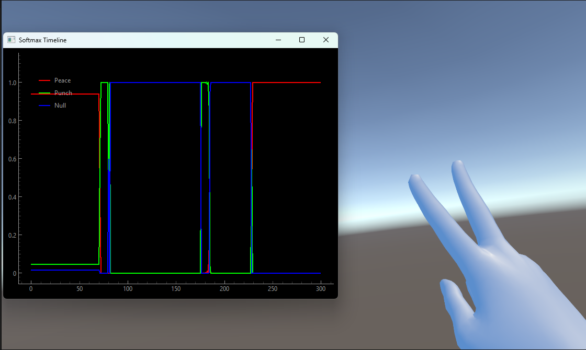

# Model Tuning

While the model and recognition algorithm can get a lot just from the samples you record and upload, there are a few things you can do to help it produce the desired output.

### Tuning Algorithm Parameters

A few parameters are exposed under the PrehensionManager to allow you to tune performance of the model.

**Build Frames**: This the number of frames of a particular gesture needed in a row before the gesture is officially recognized. The best value will be dependent on the length of the gesture you're trying to recognize (longer gestures will want higher values) and your tolerance for false positives (lower values will feel snappier, but the algorithm will be more likely to fire when a gesture hasn't actually been performed)

**Cooldown Frames**: This is the number of 'Null' frames needed in between gesture recognitions. Higher values will likely decrease false positives, but will require more time in between gestures.

Note that these values are loaded in to the algorithm at start time, so you'll need to reset when you want to change them.

### Analyzing Model Output

Included with the Prehension plugin is a tool to allow you to view the raw output of the model. This can be *extremely* effective in helping you tune the algorithm's performance, as it allows you to see exactly what's going on under the hood and why gestures may or may not be getting recognized. Sometimes errors will be a result of the training data/model itself, and sometimes they'll be a result of the recognition on top of the model in Unity.

[Download ModelMonitor.exe](../files/ModelMonitor.exe){: .btn }

Make sure 'Log Softmax Over UDP' is checked in the Prehension Manager in your main scene, run the monitoring tool, and then run the application. You should have an output like this:

As you can see here, the model is tracking 'peace' (the red line) now that the gesture has been performed. That's good!

Performing gestures and watching how the model reacts can provide insights on how to improve performance. Generally improvements fall into one of two categories:

**Improving training data**: If the model itself isn't recognizing gestures correctly, your best bet to fix it is altering your training data somehow. Adding samples to the 'Null' set that share some characteristics with your target gestures, but not all, can be particularly effective.

To make this more concrete, consider the following example: imagine you're designing an application that needs to know when the user swipes right or left with their hand, and when they punch. So you record a few samples of each - swiping left and right have an open palm pose, moving sideways, and punch has a closed fist moving forward. During testing you find that even if you don't really 'punch', as long as you start to close your fist, the model says you're punching. What happened?

Generally speaking the model is quite capable, but also quite lazy. Since 'punch' was the only gesture in your training data that included a closed fist, it learned that all closed fists equal punches. Fixing this could involve adding a few samples to your 'Null' set where you close your fist, but don't punch forward - forcing the model to learn the difference.

**Improving recoginition algorithm parameters**: If the model is firing correctly but gestures aren't getting recognized at the Unity level (or getting recognized too much), try tweaking the parameters exposed in the PrehensionManager and the Prehension Config. For a detailed description of what each parameter means and controls, see [Gesture Config Options](./GestureConfigOptions.md).
