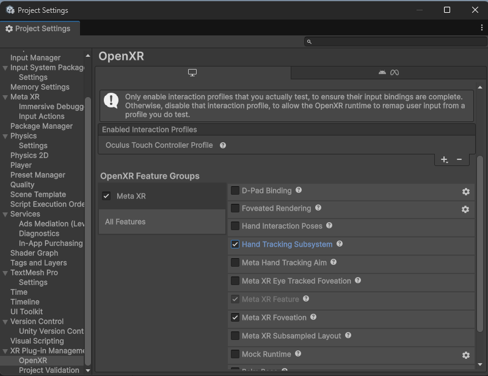

# New Project Setup
At the moment the only headset Prehension’s SDK is compatible with is Oculus/Meta. More headset support will come in the future!

The first steps for a new project will be to download and set up Meta’s SDKs to get Unity and your headset talking. They have a tutorial [here](https://developers.meta.com/horizon/documentation/unity/unity-tutorial-hello-vr/) with detailed instructions; for the most part you can follow that directly.

Follow those instructions up to “Add a grab interaction” (Under “Step 3: Add Building Blocks To Your Scene”). Our plugin will take care of the hand interaction for you, so you can skip that! Instead, search for “Hand Tracking” in their Building Blocks and add that to your main scene to get your hands tracking. You'll also need to check 'Hand Tracking Subsystem' in the Project Settings while you're setting those up.

After you get the hand tracking building block in, skip down to “Step 4: Preview Your Scene” and continue to follow the instructions. By the end you should be able to press play in the Unity Editor, and see the scene (empty for now) and your hands tracked in your headset.

### Adding the Prehension SDK

Now it's time to add the Prehension SDK. Click through Window > Package Management > Package Manager.

Click the plus icon in the top left, choose “Install package from tarball” and find the Prehension SDK.

### Set Up Your Project

With the Prehension SDK you should have a new menu button in your menu bar. Choose Prehension > Setup Project. This will create a folder in your project’s Assets folder (’PrehensionData’) that will eventually contain 3 things:

- Project Details (project name, id, and access key)
- Prehension Config (central data overview, more on this later)
- Sample Data (collection of all the gesture samples you’ve recorded for your gesture recognition model)

`PrehensionProjectDetails.json` and `PrehensionConfig.asset` should exist as soon as you set up your project. `SampleData` will get filled in later.

Alex should have given you an api key, a project name, and a project id - if he didn’t, ask him. Once you have them, fill them in to the appropriate fields in `ProjectDetails.json`

When you run Setup Project you may also get a log message about needing to install TMP Essentials. If you do, follow the instructions! They're needed for the data recording process.

Once you've got your project set up, you can move on to [Recording Data](./RecordingData.md)