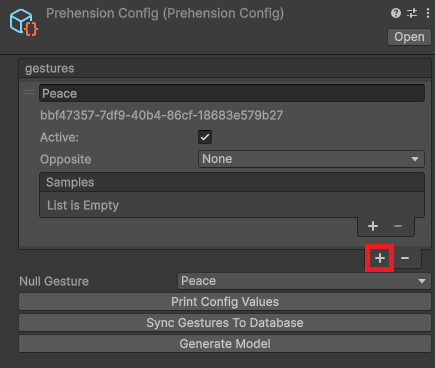
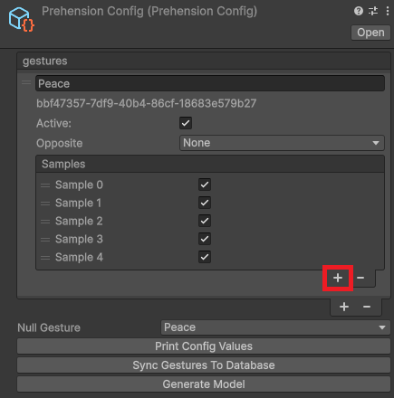
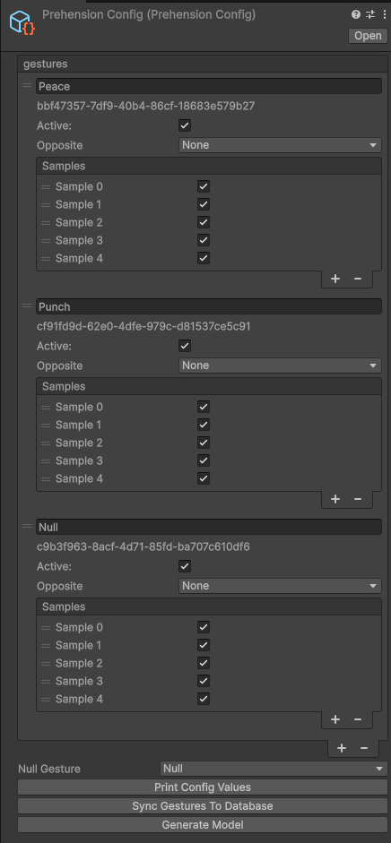
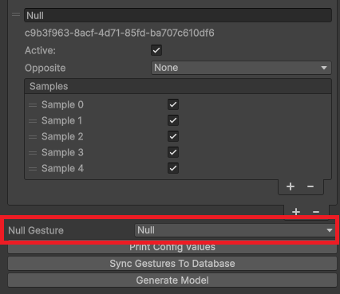
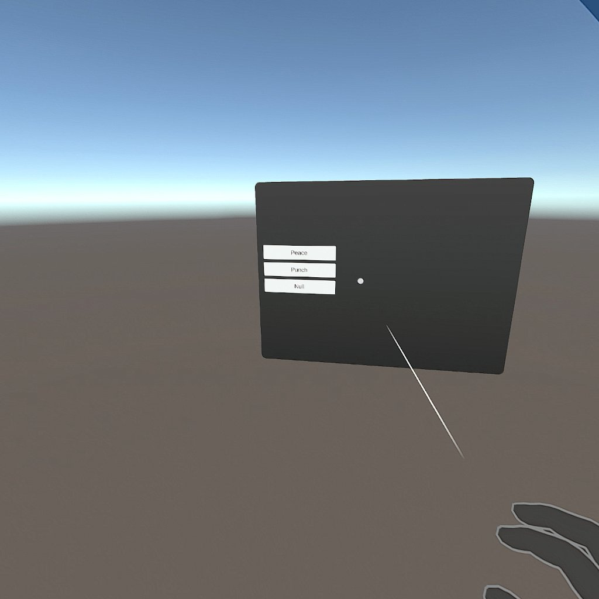
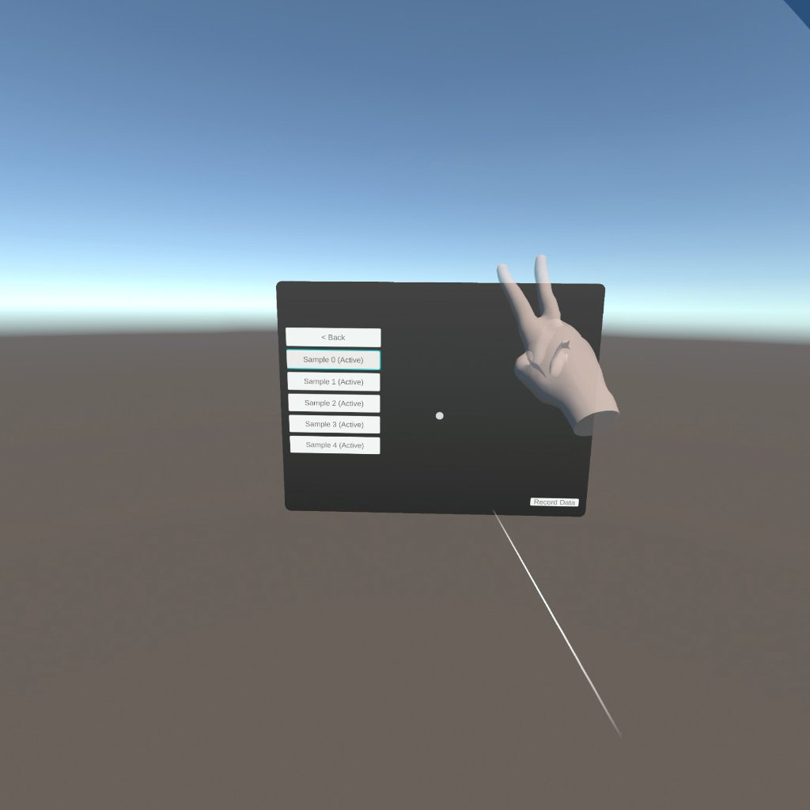
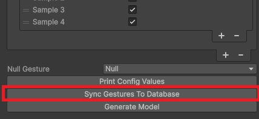
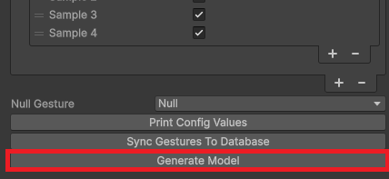

# Recording Data

You’re now officially ready to start recording some data! From the top menu bar, choose Prehension > Record Data. You may be asked if you want to save the scene you’re currently in, and then you’ll be taken to the Prehension Data Recording Scene.

At the time of this writing there’s a bug that may require you to reimport the Oculus Interaction Rig. If you’re getting ‘Missing Prefab’ errors, just delete the Interaction Rig, and then re-add it by right clicking in the Scene Hierarchy and choosing Interaction SDK > Add OVR Interaction Rig. Keep the default settings in the dialog that follows.

When you select Prehension > Record Data your config should be automatically popped in to the inspector. If it’s not, you can find it in `Assets/PrehensionData`. It should also be automatically added to the relevant field in the Prehension Data Recorder object - if it's not, you can drag it in.

The config has two major components: *gestures*, and *samples*. 

*Gestures* are the movement classes that your model will learn to recognize. Think ‘swipe left’, ‘swipe right’, ‘stop’, ‘push’, or ‘peace sign’.

*Samples* are the individual recording instances you make for each Gesture. Each Gesture can (and should) have multiple samples attached to it - the more you provide, the better idea the model will have of what exactly you want (and don’t want) to recognize.

To create a Gesture, simply click on the ‘+’ icon in the config inspector. Give it a name to identify what sort of gesture it is.

To create samples for that gesture, click on the ‘+’ attached to the samples box inside the relevant gesture.

Both gestures and samples can also be marked as active (default) or inactive - at training time this indicates whether or not you want them to be part of the training data and generated model.

You’ll need to create all the samples you wanted to record *before* entering the recording process. 5 samples per gesture is usually a good place to start.

For every config, you’ll need to include a ‘Null’ gesture - this is the gesture that the model will detect when you’re not doing anything. After you add it, scroll down to the bottom of the config and mark it as such.

Once you’ve got your config set up, press play in the recording scene. Once the scene loads you should see a panel with buttons for each of the gestures you created in your config.

From there, you can select (via point and pinch) the gesture and sample you want to record data for:

Select a sample, and then click ‘Record Data’ in the bottom right corner. You’ll see a countdown, and then the plugin will capture your hand movement. Once it’s done recording you can see the movement played back to you. If you don’t like it, you can record again and it will be overwritten. Generally the best samples should contain only the gesture of interest, and little extraneous movement besides. 'Null' samples should include a variety of movements - some moving, some more still, different hand poses, etc. For more info on recording null samples correctly, see [Model Tuning](./ModelTuning.md)
[Picture. Also is the recording length exposed for modding?]

Once you’re happy with your recordings, quit the scene and return to the Inspector view of the Prehension config.

At the bottom of the inspector are 3 buttons, 2 of which are relevant for us right now. The first thing you’ll need to do is upload your gesture samples to the database. This should be pretty quick, maybe a few seconds. Note that you’ll need to do this every time you record new samples.

The next and most important step is to generate the model itself.

This process will take significantly longer, in the realm of 5-10 minutes depending on how many samples you uploaded. You should get a progress bar in the Unity background task monitor, and once it completes you should have two files in Assets/StreamingAssets: `model.pte` and `model_vulkan.pte`.

To hook the model outputs into your application code, it's now time to [subscribe to gesture recognition hooks](./SubscribingToGestureRecognitionHooks.md).